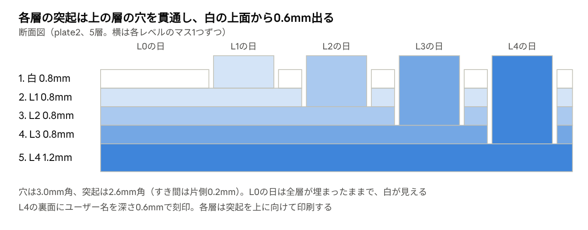

# GitHub草キーホルダー 設計まとめ

2026-09-28 · @TatsuyaM

## 概要

GitHubコントリビューション（草）54週分（27週 × 2枚）を、半年ずつ2枚のキーホルダーにする。1枚は色ごとに単色で印刷した層を重ね、はめ込みで組み立てる。4色までのプリンタでも作れるようにするための構成。

1. GitHub GraphQL APIで、開始週（省略時は取得した日を基準にした直近54週）から54週分を取得する
2. 前半と後半に分け、1枚あたり27週 × 7日のグリッドにする
3. Pythonスクリプト（`grass_keychain.py`）またはデスクトップアプリ（`app/`）で、層ごとのSTLを生成する
4. 層ごとに単色で印刷し、上から 白 → L1 → L2 → L3 → L4 の順に重ねてはめ込む
5. 白の天板には月のラベル、各層の裏にはレベルを表す識別スリットが入っているので、迷わず組み立てられる

## 検討の経緯

多色で一括印刷する案から始めたが、色数と強度の問題で、色ごとに層を分けてはめ込む積層式に変えた。

| 段階 | 案 | 結果 |
| --- | --- | --- |
| 1 | 多色一括印刷（ベース＋L0〜L4の6パーツ、1枚の3MF）、マス1.47mm、外形62.5 × 16.7mm | 後半のプレートに6色必要で、手元のプリンタ（4色まで）では印刷できない |
| 2 | マスを5mm角に拡大 | 外形が約158 × 41mmになり、キーホルダーには大きすぎる |
| 3 | マス3.0mm角を採用 | 外形103.9 × 27.4mm（マスの間隔0.4mmのとき） |
| 4 | 色ごとの積層はめ込み式に変更 | 各層を単色で印刷できる。層の壁を確保するためマスの間隔を1.0mmに広げ、外形は119.5 × 31.0mm |

## 決定した仕様

1枚の外形は120.0 × 35.0mmのキリのいいサイズで、厚さは最大4.4mm（突起込み5.6mm）。ノズル0.4mmを前提にしている。

| 項目 | 値 | オプション |
| --- | --- | --- |
| 枚数・期間 | 2枚（前半・後半の半年ずつ、1枚27週 × 7日、日曜が最上段） | — |
| マス | 3.0mm角、角丸0.5mm | `--cell` / `--cell-r` |
| マスの間隔（くり抜き間の壁厚） | 1.0mm | `--gap` |
| 穴と突起のすき間 | 片側0.2mm（突起は2.6mm角） | `--clearance` |
| 突起の飛び出し | ベースプレート（白）の上面から1.0mm | `--pin-protrude` |
| L3・L4の突起の補正 | 上記に+0.2mm（根元が長く、たわみ・収縮しやすいため） | `--pin-extra-deep` |
| 白・中間層の厚さ | 0.8mm | `--layer-t` |
| 最下層の厚さ | 1.2mm | `--bottom-t` |
| キーリング穴 | 直径4.5mm、周りの肉厚2mm、左端のタブ、全層を貫通 | `--hole-d` / `--hole-wall` |
| 外形 | マス目の周りに左右2.25mm、角丸3mm（外形の幅が120.0mmのキリのいい値になるよう調整） | `--margin` / `--corner-r` |
| 裏面の刻印 | 最下層の裏のみ。ユーザー名、太字、高さ8mm、深さ0.6mm。長い名前は幅に合わせて縮小 | `--back-text` / `--text-h` / `--text-depth` |
| 識別スリット | 各層の裏、下側の余白帯にレベル番号と同じ本数の溝を彫る（L4なら4本、L2なら2本、白は0本で無地）。幅1.0mm・間隔1.0mm、高さ2.5mm、深さ0.5mm、上下の余白0.375mmずつ（下側の余白は3.25mm） | `--mark-depth`（0で無効） / `--mark-h` / `--mark-pad` / `--mark-slit-w` / `--mark-slit-gap` |
| 月のラベル | グリッド上の余白帯に、月が変わる列の位置で英語3文字の月名（Jan〜Dec）を貫通くり抜き。白の天板のみ。文字の高さ2.5mm、上下の余白1.125mmずつ（上側の余白は4.75mm） | `--show-months`（既定オン） / `--month-label-h` / `--month-label-pad` |
| L0（草のない日） | 白のまま（くり抜かない） | — |
| 固定方法 | はめ込みのみ | — |

## 積層構造

各層は、自分のレベルのマスが突起、自分より下の層のマスが穴になっている。下の層ほど突起が長く、上の層をすべて貫通する。



| 順番 | 層 | 厚さ | 突起（層の上面からの高さ） | 穴 |
| --- | --- | --- | --- | --- |
| 1 | 白 | 0.8mm | なし | L1〜L4のマス |
| 2 | L1 | 0.8mm | L1のマス（1.8mm） | L2〜L4のマス |
| 3 | L2 | 0.8mm | L2のマス（2.6mm） | L3・L4のマス |
| 4 | L3 | 0.8mm | L3のマス（3.6mm、+0.2mm補正込み） | L4のマス |
| 5 | L4 | 1.2mm | L4のマス（4.4mm、+0.2mm補正込み） | なし（裏面に刻印） |

マスが1つもないレベルの層は作らない。そのため現在のデータでは、plate1（前半、L1のみ）は白＋L1の2層で厚さ2.0mm、plate2は5層で厚さ4.4mmになる。最下層になった層が1.2mmになり、刻印が入る。

L1・L2の突起はベースプレートの上面から一律1.0mm飛び出す。L3・L4は根元が長く、印刷時のたわみや収縮で届きにくくなる懸念があるため、+0.2mm（1.2mm飛び出し）の補正を加えている。

プレート1枚が5層になると組み立て順が分かりにくいため、各層の裏（余白帯・キーリング穴と反対側）に、レベル番号と同じ本数のスリット（溝）を彫っている（白は0本、L1は1本、L2は2本、L3は3本、L4は4本）。文字は小さいと読みにくく判読性も文字によってばらつくため、本数を数えるだけで済むtally状のスリットにした。深さ0.5mmは0.8mm厚の層でも底が残る浅い溝で、貫通はしない。グリッド部分（穴・突起がある領域）は避けているので、どの層にも入れられる。

## 月のラベル

GitHub本家のコントリビューショングラフと同じように、月が変わる列の上に月名（Jan〜Dec）を入れる。白の天板だけ、グリッド上の余白帯を月名の形に貫通させる（くり抜き）方式。埋め込み式の刻印ではなく貫通穴なので、下の層（L1など）の色が透けて見える。

- 列と月の対応は、取得したweeksデータ（各日の日付）から計算できる。各列（週）に含まれる日付の年月のうち、まだ出てきていない月が最初に現れた列にその月の略称を割り当てる（1枚目の最初の列は必ずラベルが付く）
- 文字は「e」「o」「a」のような内側に穴がある文字を含むため、貫通穴にすると内側の穴の部分だけ孤立して抜け落ちる。これを避けるため、月ラベルだけは文字の内側の穴も塗りつぶした（輪郭を潰した）形でくり抜く。裏面の刻印（掘り込みで底が残る）はこの問題がないので通常の文字のまま

## データ取得

GitHub GraphQL APIの `contributionsCollection.contributionCalendar` を、開始週（日曜）から27週ずつ2回に分けて取得する（1回あたりの範囲がAPIの1年制限に収まるようにするため）。REST APIには草のデータがない。各日の `contributionLevel`（`NONE`、`FIRST_QUARTILE`〜`FOURTH_QUARTILE`）を、そのままL0〜L4として使う。

- 開始週を指定しない場合、取得した日を基準にした直近54週になる。GitHubのデフォルト範囲（`from`/`to`省略）は、取得するタイミングの曜日によって週数が52〜54週でばらつき、plate1・plate2の列数（マス目の幅）が変わってしまう問題があった。開始週を明示的に指定して27週×2に固定することで、いつ取得しても同じ大きさのモデルになる
- 同じデータで作り直したい場合は、`--start-date`（CLI）またはGUIの「開始週」で、最初に使った日曜の日付を指定する

- トークンは環境変数 `GITHUB_TOKEN` から読む。未設定なら `gh auth token` を使う
- 必要な権限：classicトークンなら `read:user`。fine-grainedトークンなら権限なしで公開分を取得できる
- 非公開リポジトリ分も含めるには、プロフィール設定の「Include private contributions on my profile」を有効にする
- ログイン中のGitHubアカウントは `gh auth status` または `gh api user --jq .login` で確認できる
- SSLの証明書エラー（`CERTIFICATE_VERIFY_FAILED`）が出たため、`truststore` でmacOSキーチェーンの証明書を使うようにした

zshでのトークンの渡し方（画面に表示されず、履歴にも残らない）：

```zsh
read -s "GITHUB_TOKEN?Token: " && export GITHUB_TOKEN
```

## スクリプトの使い方

`grass_keychain.py` は、作業フォルダ内の `venv`（Python 3.11）で実行する。venvにはnumpy、manifold3d、matplotlib、truststoreを入れてある。

```zsh
venv/bin/python grass_keychain.py <GitHubユーザー名>                  # APIから取得して生成
venv/bin/python grass_keychain.py <ユーザー名> --start-date 2025-01-05  # 開始週（日曜）を固定して生成
venv/bin/python grass_keychain.py <ユーザー名> --json out/<ユーザー名>_contributions.json  # 保存済みデータで再生成
venv/bin/python grass_keychain.py <ユーザー名> --demo           # ランダムデータで試す
venv/bin/python grass_keychain.py -h                              # オプション一覧
```

出力先は `out/`（`--out` で変更できる）。

| ファイル | 内容 |
| --- | --- |
| `<user>_plate{1,2}_{n}_<層>.stl` | 層ごとのSTL。印刷する向き（突起が上）。nは上から重ねる順番 |
| `<user>_keychain.3mf` | 組み立てた状態の確認用。層ごとに色付きパーツ |
| `<user>_plate{1,2}_preview.png` | 組み立て後の表面・裏面・断面と、各層の図 |
| `<user>_contributions.json` | 取得した生データ。`--json` で再利用できる |

## 検証結果と印刷時の注意

実データで生成したモデルでは、層どうしの重なり体積が0で、すき間は設計どおり片側0.2mmだった。実際の印刷と、スライサーへの読み込みはまだ試していない。

- 全層の形状が正常な立体（多様体）として生成できた
- 突起はベースプレート（白）の上面からL1・L2が1.0mm、L3・L4が1.2mm（+0.2mm補正込み）飛び出す高さでそろっている
- 裏面の刻印は裏から見て読める向き。長いユーザー名では自動で縮小される

印刷時の注意：

- 片側0.2mmは、プリンタによっては緩くて抜けやすい。本番の前に小さなテスト片ではまり具合を確かめる
- 突起の根元が1層目の広がり（エレファントフット）で太ると入らない。スライサーのエレファントフット補正を有効にする
- 白の層は壁1.0mmの格子状で薄い。印刷後にベッドから剥がすときはゆっくり扱う
- 識別スリットの上下の余白は0.375mmとやや薄い（外形を120×35mmに収めるため）。うまく彫れない場合は`--mark-h` / `--mark-pad`を調整するか、外形の高さの制約を見直す

## 未決事項と次のステップ

- [ ] 2枚の厚さをそろえるか決める（空の層も作ると、2枚とも5層、4.4mmになる）
- [ ] すき間のテスト片（0.1 / 0.15 / 0.2mm）を作って印刷し、すき間を決める
- [ ] 各層の厚さ（白・中間層0.8mm、最下層1.2mm）でよいか確認する。仮の値として採用している
- [ ] 層ごとのSTLをスライサーに読み込んで、形状を確認する
- [ ] 識別スリット（幅1.0mm・深さ0.5mm）が実際に印刷してきれいに彫れるか、本数を数えやすいか確認する
- [ ] 月のラベル（文字の内側を塗りつぶした簡略字形）が印刷してもGitHub風の見た目で読めるか確認する
- [ ] 本番を印刷して組み立てる
